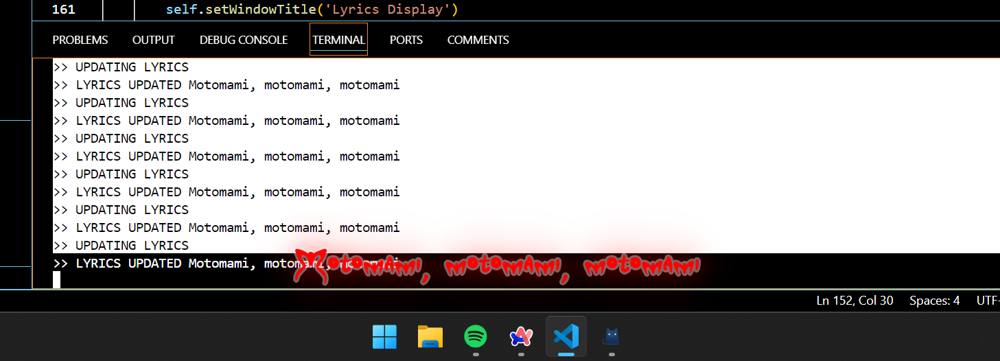
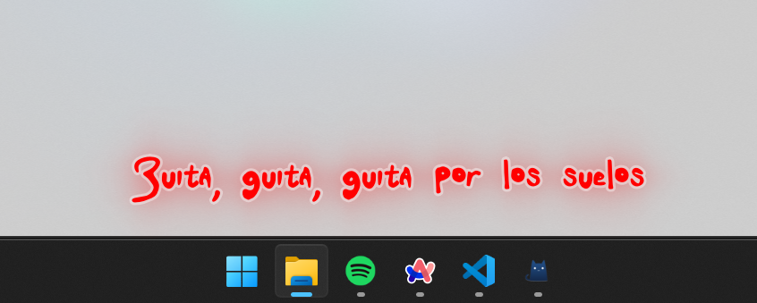
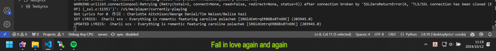

# Minimal Spotify Desktop Lyrics

***UNDER DEVELOPMENT (maybe)***
***Only tested on my own pc. Can be buggy.***

**But it looks PRETTY!**

## Made With
- PyQt5
- [syrics](https://github.com/akashrchandran/Syrics)
- [spotipy](https://github.com/spotipy-dev/spotipy)
- [pylrc](https://github.com/doakey3/pylrc)
- [winsdk](https://github.com/pywinrt/python-winsdk)

## With Reference To
- [This stackoverflow post](https://stackoverflow.com/questions/64290561/qlabel-correct-positioning-for-text-outline)
- [Py Now Playing](https://github.com/ABUCKY0/py-now-playing)

## Screenshots

## Updates

- 20241012
    - Can stay on top of taskbar now
    - Spotify API is only called to get track id for more precised lyrics matching, playback information is handled with winsdk now

## Todo

- [ ] Hide when hovered
- [ ] Option for match lyrics without track id
- [ ] Lyric lines filtering
- [ ] Lyric customization