# Minimal ~~Desktop~~ Taskbar Lyrics For *(Mainly)* Spotify 

**You can still tweak it to make it like a normal draggable lyrics widget though**

<span style="color:red; font-weight:bold;">Also works for other music players! (Though I didn't try many...)</span>

***UNDER DEVELOPMENT (maybe)***
***Only tested on my own pc. Can be buggy.***

**VERY PRETTY!**

| Layout |
|:------:|
| 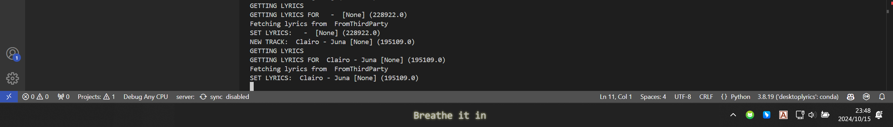 |


| Overview |
|:----------:|
| **Song/Artist Level Theme Customization** |
| 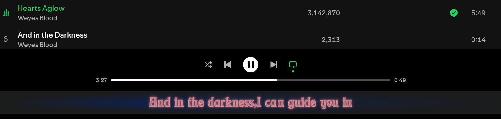 |
| **Easy Offset Setting & Auto Hide** |
| 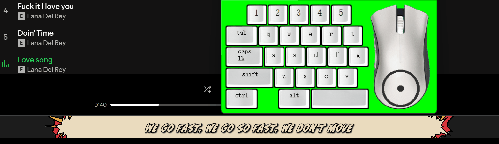 |
| **Lyrics Line Filter & Reformat** |
| 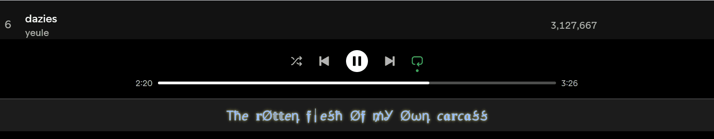 |
| **Sufjan Stevens** |
| 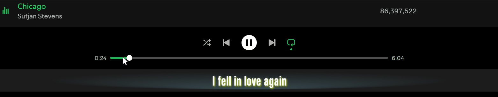 |

## Usage

### Setup
```
pip install -r requirements.txt
(proxy setting)
python ./ui.py
```

### Control

| Key | Function |
|:---:|:--------:|
| Ctrl + Mouse Hover | Keep the lyrics widget open |
| Mouse Left Button | Copy current line |
| Mouse Right Button | Switch to next lyrics provider |
| Scroll Up/Down | Adjust track lyrics offset |
| Shift + Scroll Up/Down | Adjust global lyrics offset |

**It should be noted that the song progress from WRT may be within 0-1 second error, if this bothers you then maybe you should use other spotify-API-based desktop lyrics.**

## Theme Screenshots

| Default |
|:-------:|
| 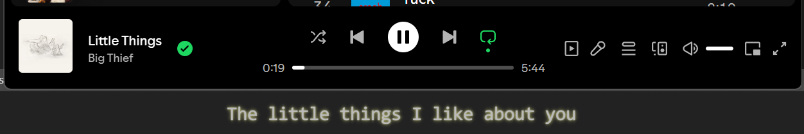 |

| Example 1 | Example 2 |
|:-----------:|:-----------:|
| 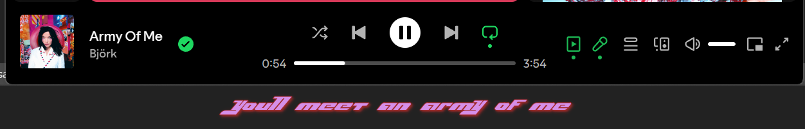 | 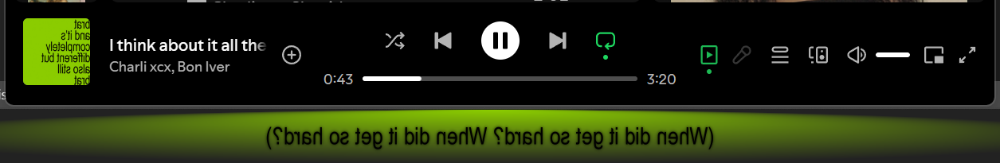 |
| **Example 3** | **Example 4** |
|  | 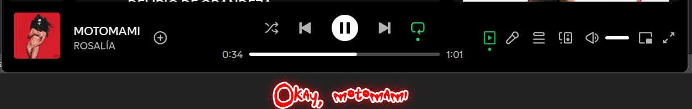 |
| **Example 5** | **Example 6** |
| 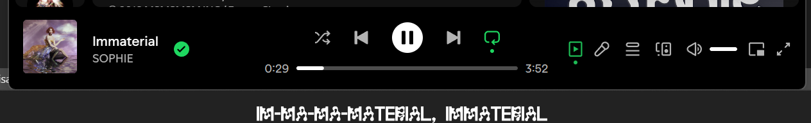 | 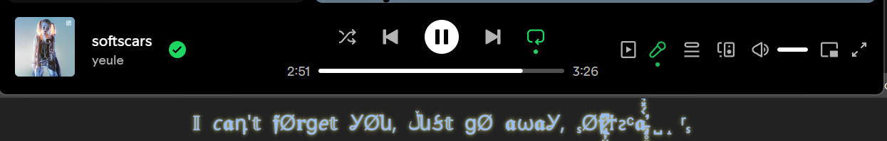 |

- *Font not provided*


## Updates

- 20241012
    - Can stay on top of taskbar now
    - Spotify API is only called to get track id for more precised lyrics matching, playback information is handled with winsdk now
- 20241015
    - AutoHide: Stay on top of taskbar, hide when mouse hover
    - LyricsCopy: Hold ctrl when entering to copy the lyrics!
    - DefaultMode: Default mode does not need spotify API nor spotify lyrics API now!
    - LyricsCustomization:
        - Supports artist/song level customization
        - Supports line re-edit
        - Style Customization
            - font
            - background
            - entering animation
- 20241022
    - Much more stable display:
        - Auto-hiding when no music is playing
    - Lyric searching no longer block the whole program
## Todo

- [x] Hide when hovered
- [x] Option for match lyrics without track id
- [x] Lyric lines filtering
- [x] Lyric customization
- [x] Searching lyrics blocks the whole program ....
- [x] Display behavior is not very stable (?)
- [ ] Long lyrics line scrollllllllllll
- [ ] Better theme management
- [ ] Fix Musixmatch lyrics searching
- [ ] Get better syncing with Spicetify?


## Made With
- PyQt5
- pyautogui
- pillow
- [syrics](https://github.com/akashrchandran/Syrics)
- [spotipy](https://github.com/spotipy-dev/spotipy)
- [pylrc](https://github.com/doakey3/pylrc)
- [winsdk](https://github.com/pywinrt/python-winsdk)

## With Reference To
- [This stackoverflow post](https://stackoverflow.com/questions/64290561/qlabel-correct-positioning-for-text-outline)
- [This stackoverflow post](https://stackoverflow.com/questions/79080076/how-to-set-a-qwidget-hidden-when-mouse-hovering-and-reappear-when-mouse-leaving)
- [Py Now Playing](https://github.com/ABUCKY0/py-now-playing)